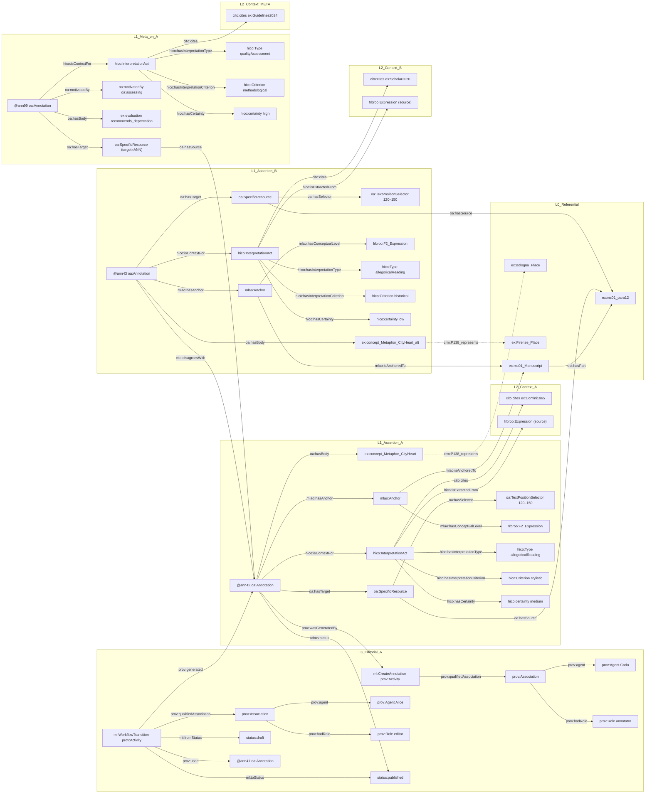

```mermaid
flowchart LR

%% ---------- L0 ----------
subgraph L0_Referential
  MS["ex:ms01_Manuscript"]
  PAR["ex:ms01_para12"]
  PLC["ex:Bologna_Place"]
  PLC2["ex:Firenze_Place"]
end

%% ---------- L1: Annotation = InterpretationAct ----------
subgraph L1_Assertion_A
  ANN["@ann42 oa:Annotation"]
  TGT["oa:SpecificResource"]
  SEL["oa:TextPositionSelector 120–150"]
  BODY["ex:concept_Metaphor_CityHeart"]
  ANC["mlao:Anchor"]
  FRBR["frbroo:F2_Expression"]
  ACT["hico:InterpretationAct"]
  TYPE["hico:Type allegoricalReading"]
  CRIT["hico:Criterion stylistic"]
  CERT["hico:certainty medium"]
end

%% ---------- L2: External context for ANN ----------
subgraph L2_Context_A
  SRC["cito:cites ex:Contini1965"]
  EXTR["frbroo:Expression (source)"]
end

%% ---------- L3: Editorial / Technical for ANN ----------
subgraph L3_Editorial_A
  CR["ml:CreateAnnotation prov:Activity"]
  TR["ml:WorkflowTransition prov:Activity"]
  AS1["prov:Association"]
  AS2["prov:Association"]
  AG1["prov:Agent Carlo"]
  AG2["prov:Agent Alice"]
  R1["prov:Role annotator"]
  R2["prov:Role editor"]
  ST_DRF["status:draft"]
  ST_PUB["status:published"]
  ANN_DRF["@ann41 oa:Annotation"]
end

%% ---------- L1b: second annotation (disagrees) ----------
subgraph L1_Assertion_B
  ANN2["@ann43 oa:Annotation"]
  TGT2["oa:SpecificResource"]
  SEL2["oa:TextPositionSelector 120–150"]
  BODY2["ex:concept_Metaphor_CityHeart_alt"]
  ANC2["mlao:Anchor"]
  FRBR2["frbroo:F2_Expression"]
  ACT2["hico:InterpretationAct"]
  TYPE2["hico:Type allegoricalReading"]
  CRIT2["hico:Criterion historical"]
  CERT2["hico:certainty low"]
end

%% ---------- L2b: External context for ANN2 ----------
subgraph L2_Context_B
  SRC2["cito:cites ex:Scholar2020"]
  EXTR2["frbroo:Expression (source)"]
end

%% ---------- L1c: Meta-annotation on ANN ----------
subgraph L1_Meta_on_A
  ANN_META["@ann99 oa:Annotation"]
  TGT_META["oa:SpecificResource (target=ANN)"]
  MOT_META["oa:motivatedBy oa:assessing"]
  BODY_META["ex:evaluation recommends_deprecation"]
  ACT_META["hico:InterpretationAct"]
  TYPE_META["hico:Type qualityAssessment"]
  CRIT_META["hico:Criterion methodological"]
  CERT_META["hico:certainty high"]
end

%% ---------- L2c: External context for META ----------
subgraph L2_Context_META
  SRC_META["cito:cites ex:Guidelines2024"]
end

%% ---------- L0 links ----------
MS -- dct:hasPart --> PAR

%% ---------- L1 links (A) ----------
ANN -- oa:hasTarget --> TGT
TGT -- oa:hasSource --> PAR
TGT -- oa:hasSelector --> SEL
ANN -- oa:hasBody --> BODY
ANN -- mlao:hasAnchor --> ANC
ANC -- mlao:hasConceptualLevel --> FRBR
ANC -- mlao:isAnchoredTo --> MS
ANN -- hico:isContextFor --> ACT
ACT -- hico:hasInterpretationType --> TYPE
ACT -- hico:hasInterpretationCriterion --> CRIT
ACT -- hico:hasCertainty --> CERT

%% ---------- L2 links (A) ----------
ACT -- cito:cites --> SRC
ACT -- hico:isExtractedFrom --> EXTR

%% ---------- L3 links (A) ----------
ANN -- prov:wasGeneratedBy --> CR
CR -- prov:qualifiedAssociation --> AS1
AS1 -- prov:agent --> AG1
AS1 -- prov:hadRole --> R1
ANN -- adms:status --> ST_PUB
TR -- ml:fromStatus --> ST_DRF
TR -- ml:toStatus --> ST_PUB
TR -- prov:used --> ANN_DRF
TR -- prov:generated --> ANN
TR -- prov:qualifiedAssociation --> AS2
AS2 -- prov:agent --> AG2
AS2 -- prov:hadRole --> R2

%% ---------- semantics (A) ----------
BODY -. crm:P138_represents .-> PLC

%% ---------- L1 links (B) ----------
ANN2 -- oa:hasTarget --> TGT2
TGT2 -- oa:hasSource --> PAR
TGT2 -- oa:hasSelector --> SEL2
ANN2 -- oa:hasBody --> BODY2
ANN2 -- mlao:hasAnchor --> ANC2
ANC2 -- mlao:hasConceptualLevel --> FRBR2
ANC2 -- mlao:isAnchoredTo --> MS
ANN2 -- hico:isContextFor --> ACT2
ACT2 -- hico:hasInterpretationType --> TYPE2
ACT2 -- hico:hasInterpretationCriterion --> CRIT2
ACT2 -- hico:hasCertainty --> CERT2

%% ---------- L2 links (B) ----------
ACT2 -- cito:cites --> SRC2
ACT2 -- hico:isExtractedFrom --> EXTR2

%% ---------- semantics (B) ----------
BODY2 -. crm:P138_represents .-> PLC2

%% ---------- disagreement ----------
ANN2 -- "cito:disagreesWith" --> ANN

%% ---------- META on ANN ----------
ANN_META -- oa:hasTarget --> TGT_META
TGT_META -- oa:hasSource --> ANN
ANN_META -- oa:motivatedBy --> MOT_META
ANN_META -- oa:hasBody --> BODY_META
ANN_META -- hico:isContextFor --> ACT_META
ACT_META -- hico:hasInterpretationType --> TYPE_META
ACT_META -- hico:hasInterpretationCriterion --> CRIT_META
ACT_META -- hico:hasCertainty --> CERT_META

%% ---------- L2 META links ----------
ACT_META -- cito:cites --> SRC_META
```
